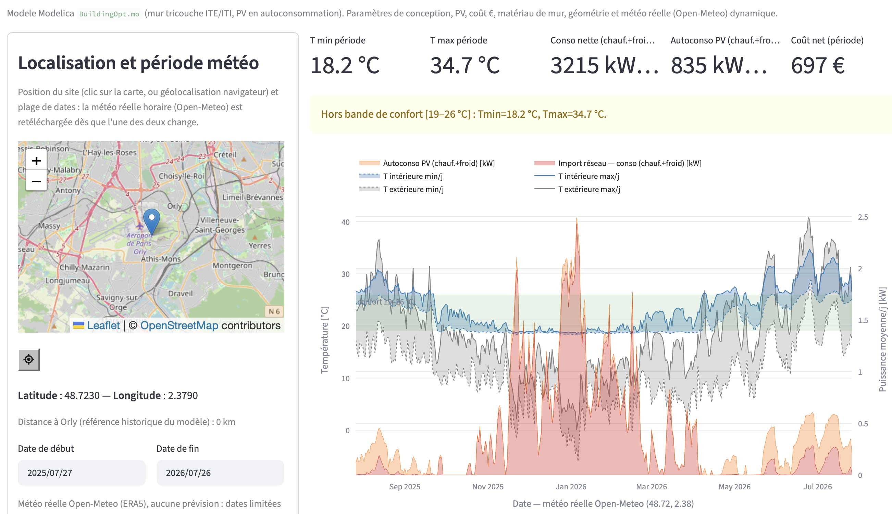

# Equilibre thermique d'habitation

Application web interactive pour explorer le confort thermique et la
consommation énergétique d'un bâtiment, à partir d'un modèle Modelica
(`BuildingTherm.mo`) : mur tricouche ITE/ISOLANT/ITE, chauffage/froid,
photovoltaïque en autoconsommation, et météo réelle dynamique par
position/dates.



## Aperçu

- **Modèle physique** ([`BuildingTherm.mo`](BuildingTherm.mo)) : réseau RC 6 nœuds
  pour un mur tricouche (isolant intérieur / paroi structurelle / isolant
  extérieur), chauffage proportionnel plafonné, PAC de rafraîchissement,
  aération naturelle diurne + surventilation nocturne, PV en
  autoconsommation directe (couvre chauffage **et** froid).
- **Géométrie paramétrable** : parallélépipède à base carrée, surface au sol
  et hauteur totale réglables.
- **Météo réelle dynamique** : température + irradiance horaires
  téléchargées depuis [Open-Meteo](https://open-meteo.com/) (réanalyse ERA5,
  sans clé API), pour n'importe quelle position (carte cliquable ou
  géolocalisation navigateur) et n'importe quelle plage de dates réelle
  (1950 → aujourd'hui, aucune prévision).
- **Simulation** : le binaire OpenModelica compilé est exécuté via
  [`fz`/`fzr`](https://pypi.org/project/fz/) plutôt qu'en appel direct, voir
  [Architecture](#architecture). Si OpenModelica n'est pas disponible (non
  installé, binaire non compilé, `fzr` en échec), l'app bascule
  automatiquement sur un solveur de secours 100% Python
  ([`BuildingTherm.py`](BuildingTherm.py)) — voir
  [Solveur de secours Python](#solveur-de-secours-python-buildingthermpy). Un
  bandeau sous le titre indique en permanence quel solveur a réellement
  tourné (🟢 OpenModelica / 🟡 Python).
- **Sorties** : indicateurs de confort et de coût sur la période choisie
  (température min/max, conso nette après PV, autoconsommation, coût en €),
  et un graphique Plotly (températures intérieure/extérieure min-max
  journalières + puissances importées/autoconsommées).

## Installation

Nécessite Python 3.10+ :

```bash
pip install -r requirements.txt
```

[OpenModelica](https://openmodelica.org/) (`omc`) est **recommandé mais
optionnel** : s'il est installé et le modèle compilé, l'app l'utilise (solveur
DAE de référence, plus rapide). En son absence, l'app fonctionne quand même
grâce au solveur de secours pur Python (`BuildingTherm.py`, dépendance
`scipy`), automatiquement.

Si OpenModelica est installé, compiler le modèle (à refaire après toute
modification de `BuildingTherm.mo`) :

```bash
omc build.mos
```

## Lancer l'app

```bash
streamlit run app.py
```

Ouvre ensuite `http://localhost:8501`.

## Architecture

```
BuildingTherm.mo         modèle Modelica (source, physique de référence)
BuildingTherm.py         reimplementation pure Python du meme modele (solveur de secours)
build.mos                script de compilation omc -> binaire BuildingTherm
app.py                   app Streamlit (UI, météo, simulation, graphique)
app_fzr/
  params.txt             template fz minimal (une seule variable : case_id)
  run.sh                 calculateur sh:// invoqué par fzr
```

La simulation ne modifie pas `BuildingTherm.mo` par run : elle réutilise le
binaire déjà compilé et lui passe les paramètres de conception via
`-override=...`, ainsi que la plage temporelle via `-startTime`/`-stopTime`.

**Pourquoi `fz.fzr` plutôt qu'un appel direct au binaire ?** Pour rester
cohérent avec le notebook d'optimisation multi-objectif qui utilise le même
framework (`fzd`/`fzr`) pour piloter OpenModelica. Deux contraintes en
découlent, gérées dans `app.py`/`app_fzr/run.sh` :

- `fzr` nomme chaque dossier de résultat par la concaténation de toutes les
  variables passées : avec ~20 paramètres (ou un chemin météo contenant des
  `/`), ce nom dépasse la limite de 255 caractères par composant de chemin.
  On ne passe donc à `fzr` qu'un identifiant court (`case_id`, hash MD5) ; les
  vraies valeurs (`-override=...`, météo, durée) transitent par un petit
  fichier d'environnement (`/tmp/buildingopt_case_<id>.sh`) que `run.sh` va
  lire.
- `fzr` exécute chaque cas dans son propre dossier temporaire : `run.sh` copie
  `BuildingTherm_init.xml`/`BuildingTherm_JacA.bin` avant de lancer le binaire.
- `fz.fzr()` installe un handler `SIGINT` via `signal.signal()`, valide
  uniquement dans le thread principal — or Streamlit exécute le script dans
  un thread de travail. `app.py` neutralise temporairement `signal.signal()`
  autour de l'appel (`_fzr_outside_main_thread`).

**Nettoyage de la sortie OpenModelica.** Le modèle génère des événements
(rampes de ventilation) qui produisent plusieurs lignes quasi simultanées
dans le CSV de sortie autour de chaque événement. `run_simulation()` regroupe
par heure entière et garde la dernière valeur (état stabilisé après
l'événement) avant de reconstruire la série temporelle — sans quoi une
indexation horaire naïve désynchronise progressivement toute la série.

## Solveur de secours Python (`BuildingTherm.py`)

`BuildingTherm.py` réimplémente les mêmes équations que `BuildingTherm.mo`
(mêmes paramètres, mêmes sorties), intégrées avec
[`scipy.integrate.solve_ivp`](https://docs.scipy.org/doc/scipy/reference/generated/scipy.integrate.solve_ivp.html)
(méthode `BDF`) plutôt qu'avec le solveur DAE de Modelica (DASSL). C'est un
recours autonome (aucun appel à `omc`/`fzr`/binaire compilé), pas une
optimisation de vitesse : sur une année complète, il tourne en ~4-5 s contre
~1-2 s pour le binaire OpenModelica déjà compilé.

**Pourquoi BDF et pas un intégrateur explicite (Euler, RK4) ?** Avec
l'isolant intérieur par défaut `e_iti = 0 m`, le nœud RC correspondant a une
résistance et une capacité thermique quasi nulles ⇒ constante de temps
sub-seconde, alors que le reste du bâtiment répond sur plusieurs heures :
c'est un système d'équations **raide** (stiff). Un intégrateur explicite à
pas fixe diverge dessus (testé : NaN en quelques pas) ; `BDF` est une méthode
implicite à pas adaptatif conçue pour ce cas, et c'est ce que fait déjà
DASSL côté OpenModelica.

**Fidélité validée** contre le binaire OpenModelica, sur une année complète
aux paramètres par défaut : écart max sur la température intérieure
0.015 K, écart sur les indicateurs annuels (conso nette, autoconsommation,
export PV) < 0.02 %.

### Équations résolues

Le modèle a 12 états : la température d'air intérieur `Tair`, 6 températures
de nœuds du mur (`T1`…`T6`, réseau RC), et 5 énergies cumulées (`Eheat`,
`Ecool`, `Egrid_cool`, `Eself_cool`, `Eexport`, intégrées uniquement après
14 j de mise en régime). Aucun événement discret : les commutations
(ventilation, chauffage/froid) sont remplacées par des rampes continues
(`min`/`max`), ce qui rend le système intégrable par un solveur ODE standard
sans détection d'événements.

**Bilan thermique de l'air intérieur :**

```
Cair · dTair/dt = (T1 − Tair)/Rsi + (UAv + UAother)·(Tout − Tair)
                  + Qheat − Qcool + Qint + Qsol
```

**Mur tricouche, réseau RC à 6 nœuds** (isolant intérieur → parpaing →
isolant extérieur, 2 nœuds par couche) :

```
C1 · dT1/dt = (Tair − T1)/Rsi + (T2 − T1)/R12
C2 · dT2/dt = (T1 − T2)/R12  + (T3 − T2)/R23
C3 · dT3/dt = (T2 − T3)/R23  + (T4 − T3)/R34
C4 · dT4/dt = (T3 − T4)/R34  + (T5 − T4)/R45
C5 · dT5/dt = (T4 − T5)/R45  + (T6 − T5)/R56
C6 · dT6/dt = (T5 − T6)/R56  + (Tout − T6)/R6e
```

**Ventilation adaptative (rampes continues anti-broutement)**, à chaque
instant t (`hour = (t/3600) mod 24`) :

```
night    = 1 si hour > 22 ou hour < 7, sinon 0
needCool = clip((Tair − 297.15)/2, 0, 1)
vfrac    = clip((Tair − Tout − 0.5)/1.5, 0, 1)
vopen    = clip((Tair − 299.15)/1.5, 0, 1) · vfrac · ach_day
boostN   = night · needCool · vfrac · ach_night
UAv      = (ach + boostN + vopen) · V · 0.34
```

**Chauffage / froid proportionnels plafonnés :**

```
Qheat = clip(Kp·(Tset_h − Tair), 0, Pheat)
Qcool = clip(Kc·(Tair − Tset_c), 0, Pcool)
```

**Électrique et PV en autoconsommation** (Ppv/Pelec en W, G(h) irradiance
horizontale du TMY) :

```
Pelec       = Qheat + Qcool/seer + boostN·V·fanWhm3
Ppv         = Ppv_kWc·1000 · (G(h)/1000) · PR_pv
Pgrid_cool  = max(Pelec − Ppv, 0)   -- import réseau résiduel
Pself_cool  = min(Pelec, Ppv)       -- autoconsommation directe
Pexport     = max(Ppv − Pelec, 0)   -- surplus injecté au réseau
```

**Indicateurs annuels**, intégrés uniquement quand `meas = 1` (après 14 j de
mise en régime) : `dEheat/dt = meas·Qheat/3.6e6`, et de même pour `Ecool`
(← `Pelec`), `Egrid_cool` (← `Pgrid_cool`), `Eself_cool` (← `Pself_cool`),
`Eexport` (← `Pexport`), en kWh.

Toutes les résistances/capacités du réseau RC (`Rsi`, `R12`…`R6e`, `C1`…`C6`)
et les constantes géométriques (`V`, `Awall`, `UAother`, `Cair`) sont des
quantités dérivées des paramètres de conception — voir
`derive_constants()` dans `BuildingTherm.py` (ou le bloc `parameter Real ...`
dans `BuildingTherm.mo`) pour le détail des formules.

## Limites connues

- Météo réelle uniquement : pas de prévision, dates bornées à aujourd'hui.
- Le chauffage est supposé électrique résistif (COP = 1) pour l'autoconso PV.
- Couverture ERA5 : la précision dépend de la résolution de la réanalyse
  (~9 km), moins fine qu'une station météo locale.
